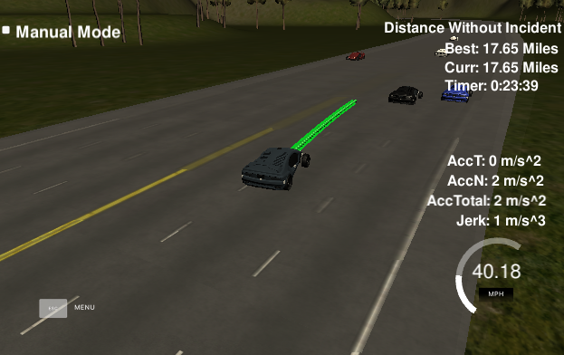

# CarND-Path-Planning-Project
Self-Driving Car Engineer Nanodegree Program
   

## Brief description

In this project, the goal was to design a path planner that is able to create smooth, safe paths for the car to follow along a 3 lane highway with traffic. A successful path planner is able to keep inside its lane, avoid hitting other cars, and pass slower moving traffic all by using localization, sensor fusion, and map data.

## Implementation

The code compiles correctly without errors with cmake and make.
Aditionally to this project I created a repository with a complete and improved implementation in C++ corresponding to the Python solution for Quiz problem on behaviour planning.
See [here|https://github.com/ninopereira/BehaviourPlanning.git].
 

1. The car is able to drive more than 4.32 miles without incidents. See an example video [https://youtu.be/DLyz3R6kQgQ].

Incidents include exceeding acceleration/jerk/speed, collision, and driving outside of the lanes.

To avoid exceeding the acceleration a simple step by step increase of the reference velocity was implementes as:
                if (too_close)
                {
                        ref_vel -= .224; // corresponds to 5 mph
                }
                else if (ref_vel < 49.5)
                {
                        ref_vel += .224;
                }
To avoid exceeding the speed limit, the maximum reference velocity was set to be 49.5. Note in the code above that reference velocity is only increased if less that the the speed limit (which is 49.5 - less than the actual 50 limit to accomodate some tolerance).

In order to avoid jerk spline trajecories were used to compute a smooth path. Also, parts of the path not yet achieved by the car in the previous iteration were used as starting points for the new trajectory. This improves smoothness and reduces jerk.

The car always drives according to the speed limit and never exceeds it. When the car in front is driving slowly we can get too close. In this situation we verify if we can change lanes. If not possible than the car slows down to avoid colliding with the car in front of us.

                const double min_distance = 20;
                // if car is too close
                if ((check_car_s>car_s) && ((check_car_s-car_s) < min_distance))
                {
                        too_close = true;
                        lane = my_car.m_lane;
                }

A cost function was implemented to verify according to the sensor fusion information if it is safe to change lanes and which lane is the best option at a given time.
The cost function takes into account distance to the goal lane, the distance to other vehicles, average speed of each lane, the cost for changing lane and other.

	double calculate_cost(Vehicle vehicle, Full_Trajectory trajectory, Predictions predictions, bool verbose=false)
	{
	    TrajectoryData trajectory_data = get_helper_data(vehicle, trajectory, predictions);
	    double cost = 0.0;

	    cost += distance_from_goal_lane(vehicle, trajectory, predictions, trajectory_data);
	    cost += inefficiency_cost(vehicle, trajectory, predictions, trajectory_data);
	    cost += collision_cost(vehicle, trajectory, predictions, trajectory_data);
	    cost += buffer_cost(vehicle, trajectory, predictions, trajectory_data);
	    cost += change_lane_cost(vehicle, trajectory, predictions, trajectory_data);
	    return cost;
	} 

The decision to change lane is only taken when it's safe and making sure that:

- the car doesn't have collisions;

- the car stays close the middle of the lane except when overtaking other vehicles;

- the car doesn't spend more than a 3 second length outside the lanes during changing lanes;

- the car stays inside one of the 3 lanes on the right hand side of the road;

- the car is able to change lanes

- the car is able to smoothly change lanes when it makes sense to do so, such as when behind a slower moving car and an adjacent lane is clear of other traffic.


## Reflection


The code model for generating paths is composed of three different blocks:

- Cost function (available as a separate file cost_functions.hpp)

- State Machine to define the behaviour (get_next_state in Vehicle.cpp together will all the class functions)

- Path Smoothing which is implemented in the main.cpp file


### Cost function 

The cost function calculates the cost associated to the vehicle being in each of the available lanes in a near future (horizon).
It computes the cost taking several things into account as:
- average speed of the cars in the lane
- distances to closest car
- collision detection by pre-computing a predicted path for changing lanes
- cost for changing lanes

It is important to emphasise here that the cost is computed for a time in future.
For that we have to predict where will all the other cars be in the future.
We calculate a predicted path for each vehicle in the future:

	Predictions predictions;
        // sensor_fusion = {id, x, y, vx, vy, s, d}
        int unique_key = 0;
        for (int i = 0; i < sensor_fusion.size(); i++)
        {
                int v_id = sensor_fusion[i][0];
                double x = sensor_fusion[i][1];
                double y = sensor_fusion[i][2];
                double vx = sensor_fusion[i][3];
                double vy = sensor_fusion[i][4];
                double s = sensor_fusion[i][5];
                double d = sensor_fusion[i][6];
                double horizon = 10;
                double time_interval = 1;
                // Create a vehicle
                Vehicle new_car;
                new_car.InitFromFusion(road,v_id,x,y,vx,vy,s,d);
                Trajectory trajectory = new_car.generate_trajectory(time_interval,horizon);
                Prediction prediction = std::make_pair(v_id,trajectory);
                predictions.insert(std::make_pair(unique_key++,prediction)); // use and then increment unique_key
        }

The predicted trajectory for each car was implemented with a straighforward exact computation. After computing the predicted path in cartesian coordinates, they were transformed to Frenet coordinates in order to determine which lane would the car be at that point in time. 
A better approach would be using a Gaussian Naive Bayes implementation.
There is scoope for improvement in this area, although pratical results were sufficiently good to meet the requirements for this project.  

### Finite State Machine

With those predictions we can compute a possible transition to a different state.
 
        State state = my_car.get_next_state(predictions);
        my_car.m_state = state;
        my_car.realize_state(predictions);

The state machine was implemented as suggested in the video classes and contains the following states:

    CS,             // constant speed
    KL,             // keep lane
    LCL,            // lane change left
    LCR,            // lane change right
    PLCL,           // Prepare lane change left
    PLCR            // Prepare lane change right

### Path Smoothing

Using previously calculated (but not used) path points together with the new calculated ones proved to be an excellent way of ensuring a 'continuous' smooth path between iterations. The spline function used here was a good choice as we don't have the issue or near vertical lines because we are using the vehicle local coordinates and the x coordinate points in the front direction.
By converting waypoint map coordinates to vehicle local coordinates we simplify a lot the calculations and prevent breaking the spline as we avoid near vertical functions.

Other smoothing functions could have been used as polynomial fitting which would also be suitable.

It is worth mentioning that the Hybrid A* is not the most taylored algorithm for this particular situation. In highways we have a very sparce environment and it makes more sense to use a cost function associated with a fitting curve function. Hybrid A* works best in cluttered environments (e.g. parkinglots) where we have a limited number of choices and also in discretised spaces. 
 
## Video Result Example:
[Path Planning |https://youtu.be/DLyz3R6kQgQ]


# Instructions

### Simulator.
You can download the Term3 Simulator which contains the Path Planning Project from the [releases tab (https://github.com/udacity/self-driving-car-sim/releases).

### Goals
In this project your goal is to safely navigate around a virtual highway with other traffic that is driving +-10 MPH of the 50 MPH speed limit. You will be provided the car's localization and sensor fusion data, there is also a sparse map list of waypoints around the highway. The car should try to go as close as possible to the 50 MPH speed limit, which means passing slower traffic when possible, note that other cars will try to change lanes too. The car should avoid hitting other cars at all cost as well as driving inside of the marked road lanes at all times, unless going from one lane to another. The car should be able to make one complete loop around the 6946m highway. Since the car is trying to go 50 MPH, it should take a little over 5 minutes to complete 1 loop. Also the car should not experience total acceleration over 10 m/s^2 and jerk that is greater than 50 m/s^3.

#### The map of the highway is in data/highway_map.txt
Each waypoint in the list contains  [x,y,s,dx,dy] values. x and y are the waypoint's map coordinate position, the s value is the distance along the road to get to that waypoint in meters, the dx and dy values define the unit normal vector pointing outward of the highway loop.

The highway's waypoints loop around so the frenet s value, distance along the road, goes from 0 to 6945.554.

## Basic Build Instructions

1. Clone this repo.
2. Make a build directory: `mkdir build && cd build`
3. Compile: `cmake .. && make`
4. Run it: `./path_planning`.

Here is the data provided from the Simulator to the C++ Program

#### Main car's localization Data (No Noise)

["x"] The car's x position in map coordinates

["y"] The car's y position in map coordinates

["s"] The car's s position in frenet coordinates

["d"] The car's d position in frenet coordinates

["yaw"] The car's yaw angle in the map

["speed"] The car's speed in MPH

#### Previous path data given to the Planner

//Note: Return the previous list but with processed points removed, can be a nice tool to show how far along
the path has processed since last time. 

["previous_path_x"] The previous list of x points previously given to the simulator

["previous_path_y"] The previous list of y points previously given to the simulator

#### Previous path's end s and d values 

["end_path_s"] The previous list's last point's frenet s value

["end_path_d"] The previous list's last point's frenet d value

#### Sensor Fusion Data, a list of all other car's attributes on the same side of the road. (No Noise)

["sensor_fusion"] A 2d vector of cars and then that car's [car's unique ID, car's x position in map coordinates, car's y position in map coordinates, car's x velocity in m/s, car's y velocity in m/s, car's s position in frenet coordinates, car's d position in frenet coordinates. 

## Details

1. The car uses a perfect controller and will visit every (x,y) point it recieves in the list every .02 seconds. The units for the (x,y) points are in meters and the spacing of the points determines the speed of the car. The vector going from a point to the next point in the list dictates the angle of the car. Acceleration both in the tangential and normal directions is measured along with the jerk, the rate of change of total Acceleration. The (x,y) point paths that the planner recieves should not have a total acceleration that goes over 10 m/s^2, also the jerk should not go over 50 m/s^3. (NOTE: As this is BETA, these requirements might change. Also currently jerk is over a .02 second interval, it would probably be better to average total acceleration over 1 second and measure jerk from that.

2. There will be some latency between the simulator running and the path planner returning a path, with optimized code usually its not very long maybe just 1-3 time steps. During this delay the simulator will continue using points that it was last given, because of this its a good idea to store the last points you have used so you can have a smooth transition. previous_path_x, and previous_path_y can be helpful for this transition since they show the last points given to the simulator controller with the processed points already removed. You would either return a path that extends this previous path or make sure to create a new path that has a smooth transition with this last path.

## Tips

A really helpful resource for doing this project and creating smooth trajectories was using http://kluge.in-chemnitz.de/opensource/spline/, the spline function is in a single hearder file is really easy to use.

---

## Dependencies

* cmake >= 3.5
 * All OSes: [click here for installation instructions](https://cmake.org/install/)
* make >= 4.1
  * Linux: make is installed by default on most Linux distros
  * Mac: [install Xcode command line tools to get make](https://developer.apple.com/xcode/features/)
  * Windows: [Click here for installation instructions](http://gnuwin32.sourceforge.net/packages/make.htm)
* gcc/g++ >= 5.4
  * Linux: gcc / g++ is installed by default on most Linux distros
  * Mac: same deal as make - [install Xcode command line tools]((https://developer.apple.com/xcode/features/)
  * Windows: recommend using [MinGW](http://www.mingw.org/)
* [uWebSockets](https://github.com/uWebSockets/uWebSockets)
  * Run either `install-mac.sh` or `install-ubuntu.sh`.
  * If you install from source, checkout to commit `e94b6e1`, i.e.
    ```
    git clone https://github.com/uWebSockets/uWebSockets 
    cd uWebSockets
    git checkout e94b6e1
    ```

## Editor Settings

We've purposefully kept editor configuration files out of this repo in order to
keep it as simple and environment agnostic as possible. However, we recommend
using the following settings:

* indent using spaces
* set tab width to 2 spaces (keeps the matrices in source code aligned)

## Code Style

Please (do your best to) stick to [Google's C++ style guide](https://google.github.io/styleguide/cppguide.html).

## Project Instructions and Rubric

Note: regardless of the changes you make, your project must be buildable using
cmake and make!


## Call for IDE Profiles Pull Requests

Help your fellow students!

We decided to create Makefiles with cmake to keep this project as platform
agnostic as possible. Similarly, we omitted IDE profiles in order to ensure
that students don't feel pressured to use one IDE or another.

However! I'd love to help people get up and running with their IDEs of choice.
If you've created a profile for an IDE that you think other students would
appreciate, we'd love to have you add the requisite profile files and
instructions to ide_profiles/. For example if you wanted to add a VS Code
profile, you'd add:

* /ide_profiles/vscode/.vscode
* /ide_profiles/vscode/README.md

The README should explain what the profile does, how to take advantage of it,
and how to install it.

Frankly, I've never been involved in a project with multiple IDE profiles
before. I believe the best way to handle this would be to keep them out of the
repo root to avoid clutter. My expectation is that most profiles will include
instructions to copy files to a new location to get picked up by the IDE, but
that's just a guess.

One last note here: regardless of the IDE used, every submitted project must
still be compilable with cmake and make./


